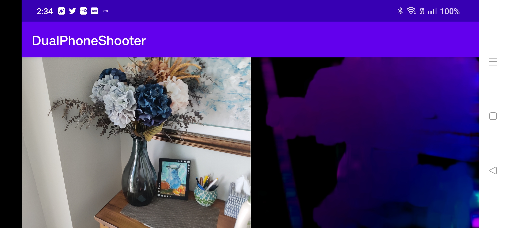

# DPShooter

DPShooter is an Android application designed to utilize the camera in order to compute optical flow. Built with OpenCV and Android's CameraX library, this application provides a streamlined approach to calculate and display optical flow.

 

## Features
- Uses the CameraX API to capture frames from camera.
- Optical flow calculation via Farneback method with OpenCV.
- RGB display of optical flow.

## Getting Started

### Prerequisites
- Android Studio 3.0 or later.
- Android SDK (API level 21 or higher).
- A physical Android device or emulator.

### Installation
1. Clone the repository from GitHub.
2. Open the project in Android Studio.
3. Run the app on your Android device or emulator.

## Usage
Launch the application on your device. The application will begin capturing frames from your camera and compute the optical flow.

## Contributing
Pull requests are welcome. For major changes, please open an issue first to discuss what you would like to change.

## License
This project is licensed under the MIT License. See the [LICENSE](LICENSE) file for details.

## Acknowledgments
- OpenCV for powerful image processing tools.
- Android's CameraX library for a simpler camera experience.
